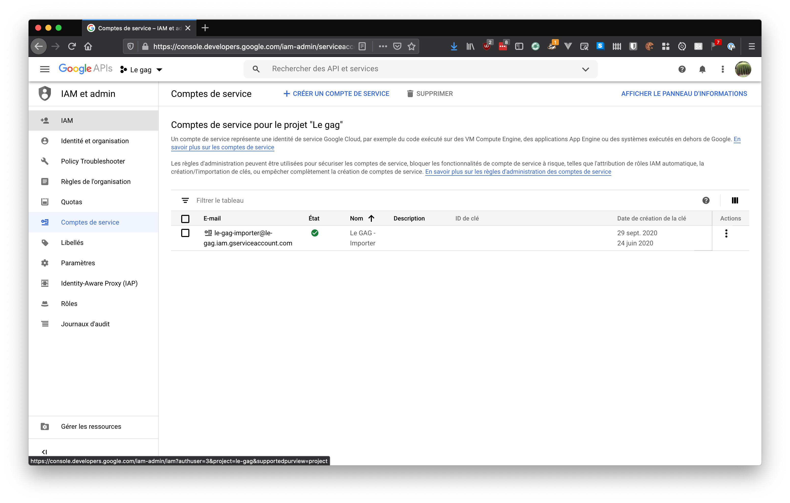
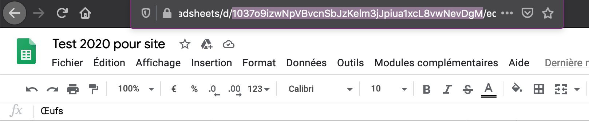

# Le GAG - Importer

This tool helps to populate the database from a spreadsheet. It can import from 
a CSV file of from a Google Spreadsheet document.

💡 The first line is expected to contain column headings; that's why it's not
imported.

## From a CSV file

````bash
./main.php csv <FILE> 
````

### `<FILE>`

The filename of the CSV file to import.

## From a Google Spreadsheet

The Google Spreadsheet adapter uses [Google Api PHP client][google-api-php-client].

````bash
./main.php google-sheets <DOCUMENT_ID> <RANGE> <JSON_KEY_FILE> 
````

### `JSON_KEY_FILE`

The filename of a JSON key file.  
To get one, create a service account in the Google Cloud Console, as shown in 
this screenshot: .

### `<DOCUMENT_ID>` 

The document identifier.  
It can be found in the spreadsheet URL: 

### `<RANGE>` 

The range of cells to import.  
It's composed of the sheet name (as shown in the tab bar at the bottom of the 
spreadsheet) optionally followed by an exclamation mark and the range of cells. 

Example: `Produits!A1:N20`


[google-api-php-client]: https://github.com/googleapis/google-api-php-client
